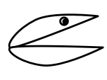

# User Requirements

Read carefully through the following book chapters from the compendium.
You find the book chapters as PDF files on Blackboard.

* Software Requirements, Third Edition Karl Wiegers and Joy Beatty, 2013, Microsoft Press. 
**Chapter 1: The Essential Software Requirement.** pp 3--23 (20 pages). 
This is a classic book on requirements, and this first chapter introduces all terms and illustrates them nicely.

* Software Requirements, Third Edition Karl Wiegers and Joy Beatty, 2013, Microsoft Press. (In the Digital Compendium, via Blackboard) **Chapter 8: Understanding User Requirements.** pp 143-165 (22 pages). 
  * The relationships _extend_ and _include_ are subtle. Don't worry too much about them.

Optionally, read through the following chapter from the compendium: _(You will need to create such a document as part of the semester project, but can also take a look at it then.)_

* Software Requirements, Third Edition Karl Wiegers and Joy Beatty, 2013, Microsoft Press.  
**Appendix C: Sample Requirements Document.** pp 575--580 (6 pages).
This is a sample requirements document, similar to one that you also will have to deliver for your project. 
The RAT will not contain question that require you to remember details from the document, but this document provides a valuable context for Chapter 1.

# Use Case Levels

_You should read through the following material before the team activity, but you don't have to remember it for the RAT._

Not all use cases are at the same level. Alistair Cockburn proposes in his book _Writing Effective Use Cases_ to sort them according to the levels inspired by a horizon, as shown in the table below. 

<table class="table">
<tr style="background-color: #F8FCFF">
    <td rowspan="2">Summary Goals</td>
    <td></img></td>
    <td><b>Cloud</b></td>
    <td>
        <ul>
            <li>Involve multiple user goals.</li>
            <li>Execute over hours, days, or weeks.</li>
            <li>Even large systems only have about five use cases at this level.</li>
            <li>Provide context for the sea-level use cases.</li>
            <li><b>Example: Offer Student Loans</b></li>
        </ul>
    </td>
</tr>
<tr style="background-color: #F8FCFF">
    <td></img></td>
    <td><b>Kite</b></td>
    <td>
        <ul>
            <li>Most of the points from above, but with a bit more details.</li>
            <li><b>Example: Check Student Loan Credibility</b></li>
        </ul>
    </td>
</tr>
<tr style="background-color: #B9E7FF">
    <td rowspan="1">User Goals</td>
    <td></img></td>
    <td><b>Sea-level</b></td>
    <td>
        <ul>
            <li>Greatest interest.</li>
            <li><b>Example: Register Student Information</b></li>
        </ul>
    </td>
</tr>
<tr style="background-color: #459EDC">
    <td rowspan="2">Subfunctions</td>
    <td></img></td>
    <td><b>Fish</b></td>
    <td>
        <ul>
            <li>Relate to sea-level use cases.</li>
            <li><b>Example: Check Submitted Formular</b></li>
        </ul>
    </td>
</tr>
<tr style="background-color: #459EDC">
    <td></img></td>
    <td><b>Clam</b></td>
    <td>
        <ul>
            <li>Clams are so low-level that you should not even write them down as separate use cases, but integrate them into another, higher-level use case.</li>
            <li><b>Example: Enter Student Name</b></li>
        </ul>
        </td>
</tr>
</table>

This hierarchy distinguished use cases at three levels: 

* In the middle, we have the level of **user goals**, represented by the **sea-level**. These are the use cases with the greatest interest for us and that we should spend most time with. They are at a medium level of detail compared to the other levels. Think of a function like _Register Student Information_ as part of a loan application system.
* At the top, there are use cases that represent **summary goals**. They describe high-level goals and why the system exist, but are a bit abstract so that it may be difficult to be sure how they are implemented. On this summary goal level, we distinguish between the very high level **cloud**, of which  a system only should have very few. For the loan application system, _Offer Student Loans_ would be such a use case. One step further down we have **kites**, which describe use cases that are a bit more concrete than cloud-levels. An example is _Check Student Loan Credibility_. 
* At the bottom, we have the level for **subfunctions**. Here, we can have useful use cases that we characterize as **fishes**. _Check Submitted Formular_ may be a function related to several goals in the system, and necessary, but is itself not a goal of a user. It's more a detailed subfunction. Below the fishes, there are even more low-level use cases, called **clams**. They are so low-level that we shouldn't even write them down. An example would be _Enter Student Name_. Instead, these should be integrated into higher level use cases. (Sorry, clams...)  

## Good Use Cases at Sea-Level

A good use case specification requires good use cases especially at the sea-level. Now you may also appreciate the analogy with the sky, the sea-level and the water. The ones in the sky are a bit fluffy and abstract, but provide the necessary goals. The ones under water are necessary, but you can get lost in them. And the ones you should focus on are at the sea-level. Good guidelines for use cases at the sea-level are the following:

* Can the user achieve their goals in this use case within 2 to 20 minutes?
* Can users have a coffee break after the use case?
* Can the primary actor go away happy after achieving the goal?
* Does the use case have 3 to 8 steps?

What should you do when use cases are **too high-level**:

- break a use case down into smaller ones
- provide details
- ask _how_ the system achieves a function

If use cases are **too low-level**:

- relate to a higher level use case
- if it is a clam: integrate as a step into another use case
- ask the question *why* the actor is doing something
- remove details and merge steps

# Optional Preparation

Have a look at the following videos that show how to create deployment diagrams.

---
type: youtube
video: tLJXJLfLCCM
---

---
type: youtube
video: _JCsqdNf8bA
---

---
type: youtube
video: SmcBTsPsbIY
---

---
type: youtube
video: q7O2EAZ_s7M
---

---
type: youtube
video: bL_Bl_Xl7wQ
---

---
type: youtube
video: x5LkaZlLT28
---

---
type: youtube
video: gYmOzpU7DDI
---